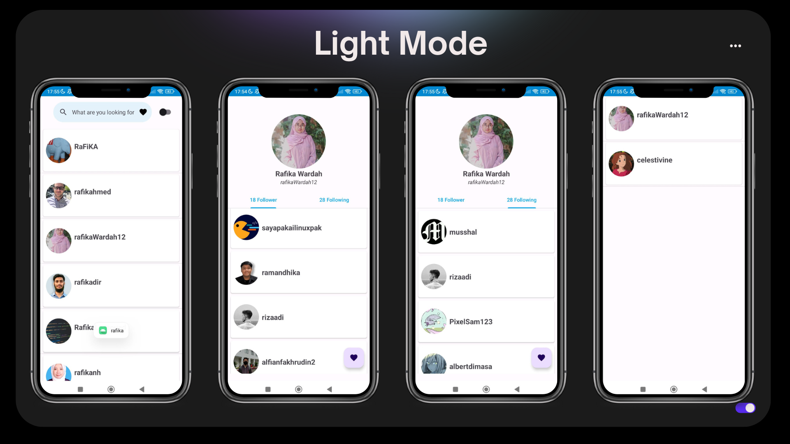
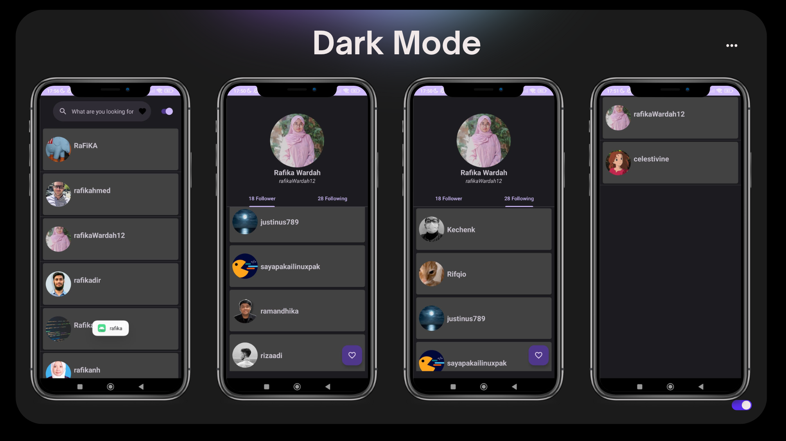

# GitHubUserFika
Project ini merupakan applikasi untuk mencari user github. Tidak hanya itu kitadapat menambahkan user ke dalam favorite list

## Features 
- [x] Applications are capable of adding users to the favorites list.
- [x] Applications are able to remove users from the favorites list.
- [x] A page is available that shows the list of favorite users.
- [x] There is an option to change the theme settings.
- [x] The application does not close unexpectedly.
- [x] Retrofit library is used for networking purposes.
- [x] Includes a share button utilizing implicit intent.
- [x] Correctly implements Android Architecture Components, including ViewModel and LiveData.
- [x] Uses DataStore for saving preferences.

## Preview 

     
      

